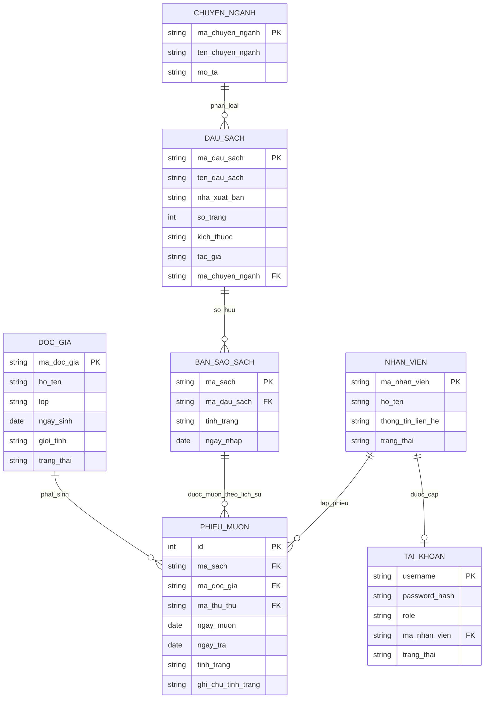

# DATABASE SCHEMA / ERD

## Mục tiêu

Tài liệu này chuyển hoá yêu cầu trong `backend/docs/SRS.md` thành **ERD mức khái niệm/logical** để phục vụ các bước tiếp theo như thiết kế migration, API và UI.

Phạm vi hiện tại là **tài liệu review được**, chưa phải schema SQL cuối cùng.

## Quyết định mô hình hoá đã chốt

- **Thẻ thư viện** được gộp trong thực thể `DOC_GIA`, không tách bảng riêng ở vòng đầu.
- `DAU_SACH.so_luong_sach` được xem là **giá trị suy ra** từ số bản sao sách (`BAN_SAO_SACH`) và **không được mô hình hoá như cột lưu trữ chuẩn trong ERD hiện tại**.
- Quan hệ giữa `NHAN_VIEN` và `TAI_KHOAN` là **1 - 0..1**.

## ERD

## Từ điển thực thể

### 1. `DOC_GIA`

**Mục đích:** Lưu thông tin độc giả/sinh viên đủ điều kiện mượn sách.

- **PK:** `ma_doc_gia`
- **Thuộc tính chính:** `ho_ten`, `lop`, `ngay_sinh`, `gioi_tinh`, `trang_thai`
- **Unique business key:** `ma_doc_gia`
- **Ghi chú:** Khái niệm thẻ thư viện được gộp vào thực thể này theo quyết định mô hình hoá hiện tại.

### 2. `CHUYEN_NGANH`

**Mục đích:** Danh mục phân loại đầu sách.

- **PK:** `ma_chuyen_nganh`
- **Thuộc tính chính:** `ten_chuyen_nganh`, `mo_ta`
- **Unique business key:** `ma_chuyen_nganh`

### 3. `DAU_SACH`

**Mục đích:** Mô tả chung của một tựa sách.

- **PK:** `ma_dau_sach`
- **FK:** `ma_chuyen_nganh -> CHUYEN_NGANH.ma_chuyen_nganh`
- **Thuộc tính chính:** `ten_dau_sach`, `nha_xuat_ban`, `so_trang`, `kich_thuoc`, `tac_gia`
- **Unique business key:** `ma_dau_sach`
- **Ghi chú:** `so_luong_sach` được xem là **giá trị suy ra** từ số bản sao thuộc đầu sách, nên không được đưa vào ERD như cột lưu trữ chuẩn ở vòng này.

### 4. `BAN_SAO_SACH`

**Mục đích:** Đại diện cho từng cuốn sách vật lý cụ thể.

- **PK:** `ma_sach`
- **FK:** `ma_dau_sach -> DAU_SACH.ma_dau_sach`
- **Thuộc tính chính:** `tinh_trang`, `ngay_nhap`
- **Unique business key:** `ma_sach`
- **Ghi chú:** Một đầu sách có thể có nhiều bản sao; một bản sao chỉ thuộc một đầu sách.

### 5. `PHIEU_MUON`

**Mục đích:** Lưu từng giao dịch mượn/trả theo thời gian.

- **PK:** `id`
- **FK:**
  - `ma_sach -> BAN_SAO_SACH.ma_sach`
  - `ma_doc_gia -> DOC_GIA.ma_doc_gia`
  - `ma_thu_thu -> NHAN_VIEN.ma_nhan_vien`
- **Thuộc tính chính:** `ngay_muon`, `ngay_tra`, `tinh_trang`, `ghi_chu_tinh_trang`
- **Ghi chú:**
  - Một `PHIEU_MUON` gắn với đúng **01 bản sao sách** và **01 độc giả**.
  - `PHIEU_MUON` đóng vai trò lịch sử mượn/trả; vì vậy `DOC_GIA` và `BAN_SAO_SACH` có thể có nhiều phiếu theo thời gian.
  - `ma_thu_thu` phải tham chiếu tới nhân viên có tài khoản/role phù hợp với nghiệp vụ thủ thư (`LIBRARIAN`); đây là ràng buộc nghiệp vụ ở tầng phân quyền, không chỉ là FK thuần.

### 6. `NHAN_VIEN`

**Mục đích:** Lưu thông tin thủ thư/quản trị viên thư viện.

- **PK:** `ma_nhan_vien`
- **Thuộc tính chính:** `ho_ten`, `thong_tin_lien_he`, `trang_thai`
- **Unique business key:** `ma_nhan_vien`
- **Ghi chú:** `ma_thu_thu` trong `PHIEU_MUON` tham chiếu đến thực thể này.

### 7. `TAI_KHOAN`

**Mục đích:** Lưu thông tin đăng nhập và phân quyền hệ thống.

- **PK:** `username`
- **FK:** `ma_nhan_vien -> NHAN_VIEN.ma_nhan_vien`
- **Thuộc tính chính:** `password_hash`, `role`, `trang_thai`
- **Unique business key:** `username`
- **Ràng buộc bổ sung:** `ma_nhan_vien` cần unique trong `TAI_KHOAN` để cưỡng chế đúng quan hệ 1 - 0..1.
- **Ghi chú:** Mỗi tài khoản thuộc đúng một nhân viên; mỗi nhân viên có thể có 0 hoặc 1 tài khoản.

## Ràng buộc nghiệp vụ chính ảnh hưởng schema

1. **Định danh phải là duy nhất**
   - `ma_doc_gia`, `ma_chuyen_nganh`, `ma_dau_sach`, `ma_sach`, `ma_nhan_vien`, `username` đều phải unique.
   - `TAI_KHOAN.ma_nhan_vien` cũng cần unique để đảm bảo một nhân viên không có nhiều hơn một tài khoản.

2. **Một độc giả chỉ được có tối đa 01 phiếu mượn chưa trả tại một thời điểm**
   - Đây là ràng buộc nghiệp vụ quan trọng, nên được phản ánh ở tầng DB bằng unique constraint có điều kiện hoặc được cưỡng chế ở service layer nếu DB không hỗ trợ trực tiếp.

3. **Người lập phiếu mượn phải là thủ thư hợp lệ**
   - `PHIEU_MUON.ma_thu_thu` phải tham chiếu đến `NHAN_VIEN` có tài khoản/quyền phù hợp với vai trò `LIBRARIAN` theo phân quyền của hệ thống.

4. **Chỉ bản sao sách ở trạng thái sẵn sàng mới được phép cho mượn**
   - Khi lập phiếu mượn thành công, `BAN_SAO_SACH.tinh_trang` phải chuyển sang trạng thái đang mượn.

5. **Khi trả sách, trạng thái phiếu mượn và bản sao sách phải cập nhật đồng bộ**
   - `PHIEU_MUON.tinh_trang` chuyển sang trạng thái phù hợp.
   - `BAN_SAO_SACH.tinh_trang` cập nhật theo thực trạng kiểm tra sách.

6. **Không được xóa bản ghi đang có phụ thuộc nghiệp vụ hoạt động**
   - Không xóa `DAU_SACH` nếu còn `BAN_SAO_SACH` hoặc giao dịch liên quan chưa xử lý.
   - Không xóa `BAN_SAO_SACH` nếu đang được mượn hoặc còn gắn với phiếu mượn chưa hoàn tất.
   - Không xóa `DOC_GIA` nếu còn sách chưa trả.
   - Không xóa `NHAN_VIEN` nếu còn `TAI_KHOAN` liên kết hoặc còn được tham chiếu trong lịch sử `PHIEU_MUON`; nên ưu tiên khóa/ngừng hoạt động thay vì xóa cứng.

7. **Báo cáo mượn nhiều tính theo đầu sách, không tính theo bản sao**
   - Các thống kê báo cáo nên aggregate từ `PHIEU_MUON` qua `BAN_SAO_SACH -> DAU_SACH`.

## Giá trị enum đề xuất để review

> Đây là bộ giá trị chuẩn hoá đề xuất để thống nhất ERD. Có thể điều chỉnh khi chốt schema vật lý.

### `DOC_GIA.trang_thai` (ReaderStatus)

- `ACTIVE`
- `LOCKED`
- `INACTIVE`

### `DOC_GIA.gioi_tinh` (Gender)

- `MALE`
- `FEMALE`
- `OTHER`

### `BAN_SAO_SACH.tinh_trang` (BookCopyStatus)

- `AVAILABLE`
- `BORROWED`
- `DAMAGED`
- `LOST`
- `NEEDS_REVIEW`

### `PHIEU_MUON.tinh_trang` (LoanStatus)

- `BORROWED`
- `RETURNED`
- `NEEDS_REVIEW`

### `TAI_KHOAN.role` (AccountRole)

- `ADMIN`
- `LIBRARIAN`
- `LEADER`

## Thành phần chưa đưa thành bảng riêng

Hiện tại ERD **không** tách các thành phần sau thành bảng riêng:

- **THẺ_THƯ_VIỆN**: được gộp vào `DOC_GIA`
- **BÁO_CÁO**: là dữ liệu tổng hợp từ giao dịch, không phải master data
- **ROLE**: đang được giữ dạng enum tại `TAI_KHOAN.role`

## Điểm mở cần xác nhận thêm ở vòng sau

1. Có cần lưu `so_luong_sach` như cột vật lý để tối ưu truy vấn hay chỉ tính động?
2. Có áp dụng **soft delete** thay vì hard delete cho các bảng nghiệp vụ không?
3. Bộ giá trị enum cuối cùng cho `PHIEU_MUON.tinh_trang` có cần chi tiết hơn không?
4. Có bắt buộc thêm cột audit như `created_at`, `updated_at`, `created_by`, `updated_by` cho toàn bộ bảng chính không?
5. Trường `thong_tin_lien_he` của `NHAN_VIEN` có cần tách thành `email`, `so_dien_thoai`, `dia_chi` không?

## Truy vết về SRS

ERD này được suy ra chủ yếu từ các phần sau trong `backend/docs/SRS.md`:

- **FR-03 -> FR-24**: yêu cầu chức năng cho độc giả, sách, mượn trả, báo cáo, tài khoản
- **BR-01 -> BR-12**: ràng buộc nghiệp vụ
- **Mục 7 - Mô hình dữ liệu khái niệm**: các thực thể và quan hệ nền tảng

## Kiểm tra khi review

- ERD đã bao phủ đủ 7 thực thể chính trong SRS.
- Các cardinality chính đã được thể hiện rõ trong sơ đồ.
- Các ràng buộc không biểu diễn hết bằng Mermaid đã được ghi bằng văn bản.
- Tài liệu vẫn giữ mức logical/conceptual, chưa khẳng định chi tiết vật lý vượt quá SRS.
